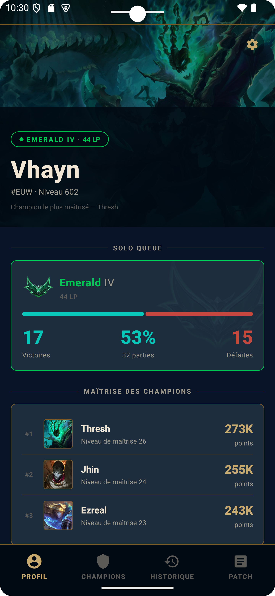
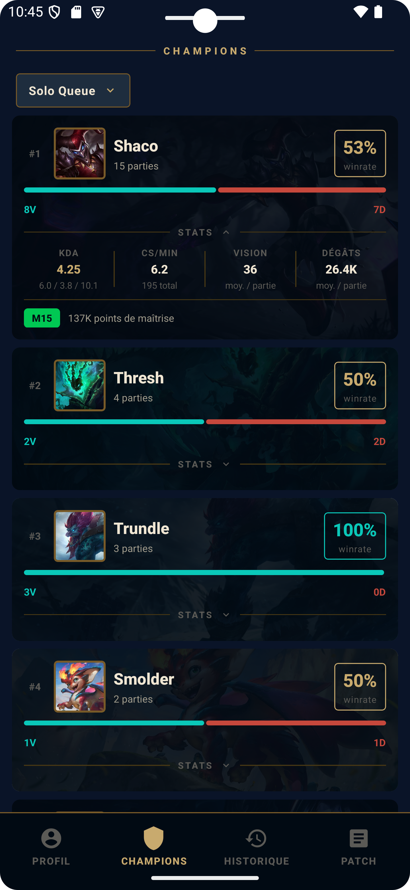
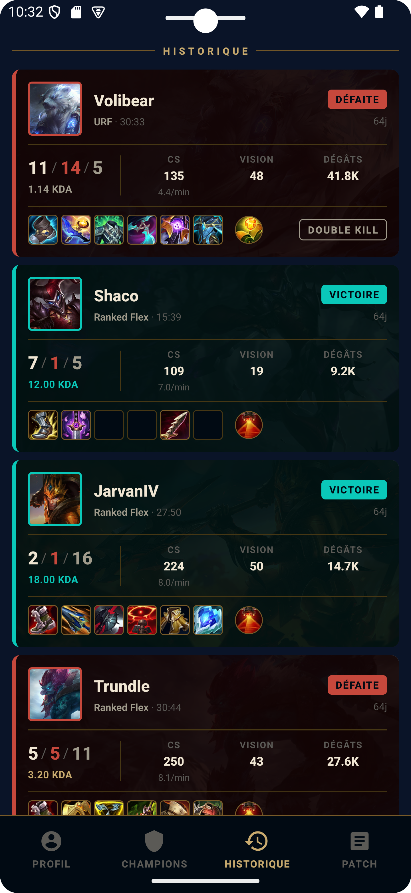
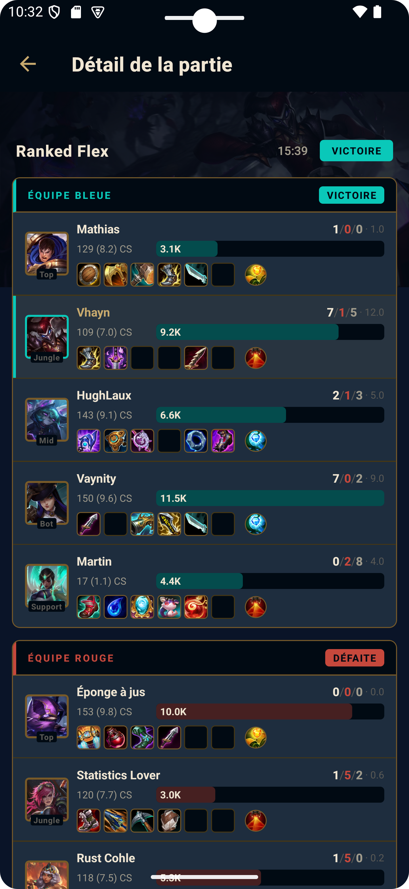
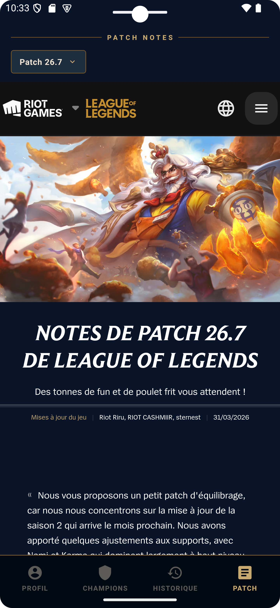

# RiftTrack

**RiftTrack** est une application mobile pour suivre vos performances sur **League of Legends**. Profil, historique des
parties, statistiques par champion, et notes de patch — tout au même endroit.

---

## Aperçu

<table>
  <tr>
    <td align="center"><br/><sub>Profil</sub></td>
    <td align="center"><br/><sub>Champions</sub></td>
    <td align="center"><br/><sub>Historique</sub></td>
    <td align="center"><br/><sub>Détail de partie</sub></td>
    <td align="center"><br/><sub>Patch Notes</sub></td>
  </tr>
</table>

---

## Fonctionnalités

- **Profil** — Rang, LP, winrate et maîtrise des champions en un coup d'oeil
- **Champions** — Statistiques détaillées par champion (KDA, vision, dégâts, winrate) filtrées par mode de jeu
- **Historique** — Liste de vos dernières parties avec résultat, champion joué et stats clés
- **Détail de partie** — Tableau complet avec les deux équipes, items, scores et durée
- **Patch Notes** — Notes de mise à jour officielles de League of Legends intégrées directement dans l'app

---

## Stack technique

- [Expo](https://expo.dev) / React Native
- Expo Router (file-based routing)
- TypeScript

---

## Lancer le projet

```bash
npm install
npx expo start
```

Ouvre ensuite l'app dans :

- Un émulateur Android / iOS
- [Expo Go](https://expo.dev/go) sur ton téléphone
- Un build de développement
